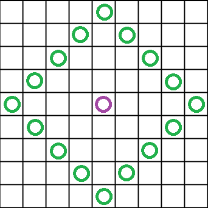

# 술식전개

## 문제

귀살대 창식이는 어느날 길을 걷던 중 무한성에 빠져버렸다.

창식이는 무한성을 탐색하던 중 저 멀리서 아카자가 오고있다는것을 알아차렸지만, 너무 큰 정신적 충격에 그만 발이 굳어버리고 말았다!
아카자는 그런 창식이를 잡으러 최대한 빨리 뛰어가려고 한다.

무한성은 $N$*$M$크기의 직사각형 모양을 띄고있으며, $N$*$M$개의 방들에는 각각 해당 방에서 얻을 수 있는 힘의 크기가 정해져있다.

아카자는 "술식전개"를 통해 창식이를 잡으러 간다.

아카자가 술식을 전개하면 그를 중심으로 3*3범위의 무한성 방들에 할당된 힘을 끌어모은다.

아카자는 끌어온 힘들의 합 $F$를 이용해 현재 위치에서 $F$개의 방만큼 떨어진 곳으로 이동할 수 있다.

예를 들어, 술식전개를 통해 4의 힘을 끌어왔을 때 아카자가 이동할 수 있는 방은 다음과 같다.



보락색 원이 아카자를, 초록색 원이 아카자가 이동할 수 있는 방을 나타낸다.

만약 아카자의 술식 범위가 무한성의 범위를 초과했을 때엔 무한성 범위 내에 있는 힘만을 끌어온다.

창식이는 현재 ($a$, $b$)에 있고, 아카자는 ($c$, $d$)에 있다.

또한 아카자가 ($a$, $b$)에 도달하면 창식이를 잡을 수 있다.

## 입력

첫째 줄에는 무한성의 세로 크기 $N$과 가로 크기 $M$이 공백으로 구분되어 주어진다. ($2 ≤ N, M ≤ 100$)

둘째 줄에는 창식이와 아카자의 위치를 나타내는 정수 $a$, $b$, $c$, $d$가 주어진다. ($0 ≤ a, c < N$), ($0 ≤ b, d < M$)

셋째 줄부터 각 $N$개의 줄에 $M$개의 수가 주어진다.

i번째 줄의 j번째 수는 무한성의 $(i, j)$ 위치의 힘 $f_{ij}$를 나타낸다. ($0 ≤$ $i$ $<$ $N$), ($0 ≤ j < M$) , ($0 ≤ f_{ij} ≤ 100$)

입력은 모두 정수로 이루어져있다.

## 출력

아카자가 ($a$, $b$)에 도달하기 위해 필요한 술식전개의 최소 횟수를 출력한다.

만약 아카자가 창식이를 잡을 수 없는 경우, ";("를 출력한다.

## 예제

### 입력1

```
6 6
1 2 6 5
1 0 1 0 1 0
0 1 0 1 0 1
1 0 1 0 1 0
0 1 0 1 0 1
1 0 1 0 1 0
0 1 0 1 0 1 
```

### 출력1

```
2
```

### 입력2

```
2 2
1 1 1 2
0 0
0 0
```

### 출력2

```
;(
```
