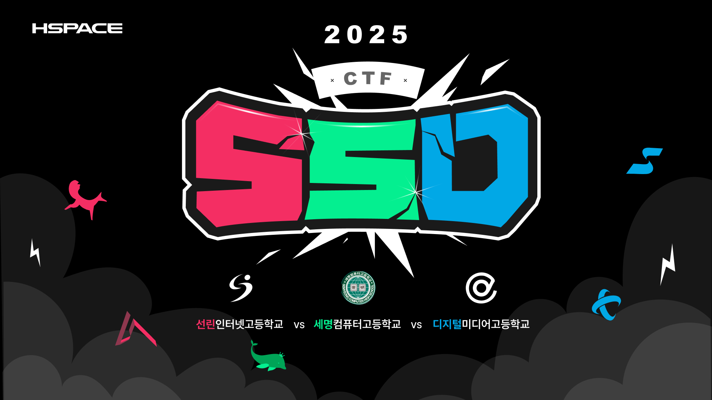

# SSD CTF 2025 Challenges

SSD CTF는 선린인터넷고, 세명컴퓨터고, 한국디지털미디어고가 함께하는 고등학교 대항전 해킹 대회입니다.

각 학교에서 2개 이상의 전공동아리 위주로 참여해 한 팀을 구성하며, 온라인으로 문제를 풀이하는 방식으로 진행됩니다.
이번 대회는 학교 간 교류와 협업을 통해 네트워크를 형성하고, 다양한 해킹 문제를 경험함으로써 실력을 향상시키는 것을 목표로 합니다. 

## List

|    Category   | problem |   Author |
|:-------------:|:------------:|:--------:|
| Pwnable | [bot_cake](./PWN/bot_cake/) | 조수호 |
| Pwnable | [catchme](./PWN/catchme/) | 안우진 |
| Pwnable | [find_bird](./PWN/find_bird/) | 강희찬 |
| Pwnable | [osh](./PWN/osh/) | 김영민 |
| Pwnable | [graffiti](./PWN/graffiti/) | 김영민 |
| Programming | [double](./Programming/double/) | 조수호 |
| Programming | [one_apple](./Programming/one_apple/) | 조수호 |
| Programming | [무시무시한_미로](./Programming/무시무시한_미로/) | 서재연 |
| Programming | [불멸의_검](./Programming/불멸의_검/) | 김승철 |
| Programming | [술식전개](./Programming/술식전개/) | 서재연 |
| Programming | [차이의_합](./Programming/차이의_합/) | 김승철 |
| Web | [HDD](./WEB/HDD/) | 박진완 |
| Web | [Kids](./WEB/Kids/) | 가세혁 |
| Web | [SSD](./WEB/SSD/) | 박진완 |
| Web | [WP-Recon](./WEB/WP-Recon/) | 정성훈 |
| Web | [DigitalArt_Gallery](./WEB/DigitalArt_Gallery/) | 이현규 |
| REV | [Everything Wrong](./REV/Everything%20Wrong/) | 임지윤 |
| REV | [its mine everything!!!](./REV/its%20mine%20everything!!!/) | 이재영 |
| REV | [SOmething Wrong](./REV/SOmething%20Wrong/) | 임지윤 |
| REV | [zoodasa](./REV/zoodasa/) | 이재영 |
| REV | [koreant](./REV/koreant/) | 이재영 |
| REV | [Dirty_VM](./REV/Dirty_VM/) | 송은우 |

> 주최/주관 : [선린인터넷고등학교](https://sunrint.sen.hs.kr/)  
> 후원 : [HSPACE](https://hspace.io)

> 운영진 : [이동건(Beef)](https://github.com/dlehdrjsgg), [서재연(jaexeon)](https://github.com/jaexeon), [임지윤(Tuple)](https://github.com/tuplest), [박진완(goldleo1)](https://github.com/goldleo1), [강희찬(Yeonba0918)](https://github.com/Yeonba0918)

> 블로그 바로가기 : https://blog.layer7.kr/ssd-ctf
